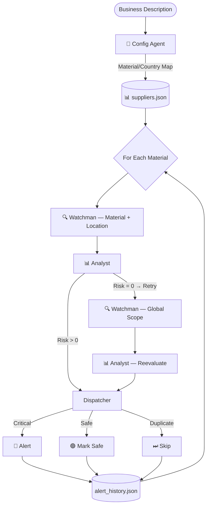
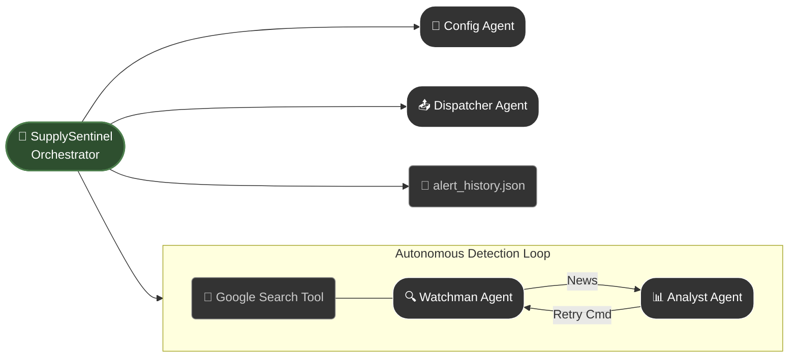

# 🛡️ SupplySentinel — Autonomous Multi-Agent AI for Supply Chain Risk Protection


> A single mining strike in Chile can shut down an EV factory in California.
> **SupplySentinel detects that BEFORE contracts are broken and production halts.**

---

## 🌍 Live Demo

| Resource              | Link                                                                                                                   |
| --------------------- | ---------------------------------------------------------------------------------------------------------------------- |
| 🚀 Web App (no setup) | [https://supply-sentinel-144683821783.us-central1.run.app/](https://supply-sentinel-144683821783.us-central1.run.app/) |
| 🎥 Demo Video         | [https://youtu.be/fiqA1lf8PQk](https://youtu.be/fiqA1lf8PQk)                                                           |
| 📂 Repository         | [https://github.com/G26karthik/SupplySentinel](https://github.com/G26karthik/SupplySentinel)                           |

---

## ⚡ What it Does (30-sec summary)

Instead of procurement teams manually tracking thousands of global signals, **SupplySentinel automates the entire pipeline**:

| Step                            | Human Effort Today    | With SupplySentinel        |
| ------------------------------- | --------------------- | -------------------------- |
| Identify critical raw materials | Hours                 | 0                          |
| Monitor global risk signals     | Impossible            | 24/7 autonomous            |
| Validate credibility of threats | Manual interpretation | AI-driven severity scoring |
| Prevent alert spam              | Rarely                | Built-in deduplication     |
| Detect disruption early         | Usually too late      | Before impact              |

You say:

> “I manufacture aerospace components in Germany.”

The system then:
→ finds critical materials
→ maps producing countries
→ searches live news globally
→ scores disruption risk
→ alerts **only when relevant + non-duplicate**

---

## 🧠 Why Agents (Not Just One LLM Prompt)

| Agent                | Responsibility                                         |
| -------------------- | ------------------------------------------------------ |
| **Config Agent**     | Business → critical materials + countries              |
| **Watchman Agent**   | Live disruption scanning via Google Search tool        |
| **Analyst Agent**    | Scores severity + triggers retry when evidence is weak |
| **Dispatcher Agent** | Issues alerts & suppresses duplicates                  |

### 🔄 Autonomy

If Watchman returns insufficient evidence, **Analyst commands a retry with expanded search scope** (not hardcoded branching).

### 🧠 Memory

Persistent JSON state across runs:

* suppliers.json
* alert_history.json
* metrics_history.json

### 🏃 Continuous Monitoring

Streamlit UI OR CLI long-running mode — supports 24/7 monitoring.

---

## 📐 Architecture (Full)


### 🔁 Simplified Orchestration Overview

## 🧪 Example Output

```
"I manufacture electric vehicles in California"

Critical Materials:
• Lithium — Chile
• Cobalt — DRC
• Rare Earths — China

Result:
Watchman → insufficient evidence
Analyst → RETRY triggered
Watchman (global scope) → disruption detected
Risk Score = 8/10 → Critical Alert (not duplicate)
```

---

## 🟦 Who Would Use This (Real Roles in Enterprises)

| Persona                | Value                                     |
| ---------------------- | ----------------------------------------- |
| VP of Supply Chain     | See disruptions before revenue loss       |
| Procurement Manager    | Avoid SLA penalties                       |
| Risk & Compliance      | Proactive risk mitigation                 |
| Logistics & Operations | Forward planning before shortages         |
| Sourcing Analyst       | Visibility into tier-2 / tier-3 suppliers |

This is **not a chatbot** — it is a **risk defense system**.

---

## 🧪 Try These Prompts (for demo & onboarding)

Copy into Web App:

| Prompt                                           | Industry              |
| ------------------------------------------------ | --------------------- |
| I manufacture EV batteries in Texas              | Automotive / Energy   |
| I build medical devices in Germany               | MedTech               |
| I produce military-grade semiconductors in Japan | Electronics / Defense |
| I run a wind turbine assembly plant in Denmark   | Renewable energy      |
| I manufacture aerospace components in France     | Aerospace             |

---

## 📊 Value Delivered

| Business Metric      | Impact |
|----------------------|--------|
| Monitoring effort    | **Reduced from daily manual checks → fully automated** |
| Alert noise          | **Duplicate and low-value alerts suppressed to prevent fatigue** |
| Risk visibility      | **Reveals tier-2 and tier-3 supplier exposure normally invisible to procurement teams** |
| Downtime prevention  | **Disruptions detected early enough to act before production impact** |


---

## 💻 Quick Start (Local)

```bash
git clone https://github.com/G26karthik/SupplySentinel.git
cd SupplySentinel
pip install -r requirements.txt
streamlit run app.py
```

➡ No `.env` required — API key entered in UI.

---

## 🪵 Project Structure

```
SupplySentinel/
├── app.py                # Web UI
├── supply_sentinel.py    # CLI monitor
├── config_agent.py
├── watchman_agent.py
├── analyst_agent.py
├── dispatcher_agent.py
├── logging_config.py
├── metrics_tracker.py
├── logs/
└── README.md
```

---

## 🌐 Deployment

```bash
gcloud run deploy supply-sentinel \
  --source . \
  --allow-unauthenticated \
  --region us-central1
```

Fully deployed version already live on **Google Cloud Run**.

---

## 🧭 Roadmap

| Stage                           | Status            |
| ------------------------------- | ----------------- |
| Multi-agent autonomy            | ✅ complete        |
| Logging & metrics               | ✅ complete        |
| Cloud deployment                | ✅ complete        |
| Parallel scanning               | 🔜 in development |
| ERP + Slack/Teams integration   | 🔜 planned        |
| Predictive cost impact modeling | 🔜 planned        |

---

## ⭐ Support

If this project interests you, consider giving the repo a ⭐ — it helps more developers discover it.

---

## 📝 License

MIT License

---

### 👏 Acknowledgment

Built for the **Google × Kaggle Agents Intensive — Enterprise Track (Nov 2025).**

---
