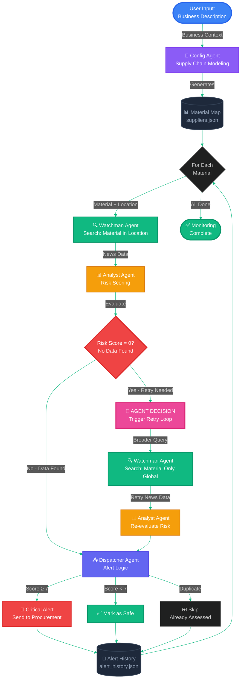

# 🛡️ SupplySentinel — Multi-Agent AI for Autonomous Supply Chain Risk Protection

**Track:** Enterprise Agents
**Capstone:** Google x Kaggle Agents Intensive (Nov 2025)
**Author:** G Karthik Koundinya

---

## 🚨 1. Problem

Global supply chains are increasingly fragile. Manufacturers across automotive, energy, aerospace, electronics and pharmaceuticals lose **$2.1 trillion annually** due to unexpected disruptions such as:

* Political instability
* Trade restrictions
* Natural disasters
* Labor strikes
* Logistics bottlenecks

Even world-class procurement teams fail because:

> **69% of disruptions originate from second- or third-tier suppliers that are never monitored.**

Existing tools are reactive — they surface risk **after** it has already impacted production.

---

## 🌟 2. Solution: SupplySentinel

SupplySentinel is an **autonomous, multi-agent Gemini-powered system** that **continuously monitors global supply chains and dispatches real-time alerts before disruptions hit production.**

> In one click, the system takes a business description → maps supply dependencies → scans global risk signals → scores threats → issues alerts only when critical.

---

## 🧠 3. Why Agents?

A single LLM cannot simultaneously map supply chains, search global risk, reason about threat scoring, and manage alert memory.

SupplySentinel assigns each cognitive responsibility to an independent agent, allowing:

| Agent Role           | Specialization                        | Why Independence Matters                                       |
| -------------------- | ------------------------------------- | -------------------------------------------------------------- |
| **Config Agent**     | Supply chain materials modeling       | Converts high-level business info into material dependencies   |
| **Watchman Agent**   | Real-time intelligence scanning       | Parallel monitoring across materials and locations + retry logic |
| **Analyst Agent**    | Risk scoring + retry decisions        | Produces consistent, auditable risk classification + autonomous retry triggers |
| **Dispatcher Agent** | Alert memory & deduplication          | Prevents alert fatigue and manages long-term state             |

This transforms risk monitoring from **reactive** → **proactive + autonomous**.

---

## 🏗️ 4. Multi-Agent Architecture

**Key Agentic Features:**
- ✅ **Autonomous Retry Loop**: If risk score = 0, Agent decides to retry with broader search
- ✅ **Material-Based Modeling**: Focuses on materials (e.g., "Lithium") and dominant export countries (e.g., "Chile"), not specific companies
- ✅ **Self-Correction**: Watchman accepts Analyst's retry command and adjusts search strategy
- ✅ **Long-running mode**: Supports repeated execution (continuous 24/7 monitoring)

**How It Works:**
Simulates industry-standard dependencies to provide instant risk coverage without requiring sensitive data uploads. Instead of asking for proprietary supplier lists, the system intelligently maps critical materials based on business context.

---

### 📐 Architecture Diagram


---

## 🧩 5. Features from the Course Demonstrated

| Capstone Key Concept    | Status in SupplySentinel                                        |
| ----------------------- | --------------------------------------------------------------- |
| Multi-Agent System      | ✔ Four agents with sequential handoffs + agentic retry loop     |
| Tools                   | ✔ Native **Google Search Grounding**                            |
| Long-Running Operations | ✔ CLI monitor mode (24/7)                                       |
| Memory / State          | ✔ Persistent alert memory (`alert_history.json`)                |
| Context Engineering     | ✔ Prompt conditioning per-agent + materials-focused modeling    |
| Deployment              | ✔ Live production on **Google Cloud Run**                       |
| Observability           | ✔ Structured logging + Live Logs UI + Historical metrics        |
| Autonomous Decision     | ✔ Agent-driven retry loop when data insufficient                |

> Minimum required concepts = **3**
> SupplySentinel demonstrates **8**

---

## 💻 6. Live Demo (No Setup Required)

🚀 **Web App:**
[https://supply-sentinel-144683821783.us-central1.run.app/](https://supply-sentinel-144683821783.us-central1.run.app/)

**Features:**

1. **🛡️ Supply Chain Monitor** (Main Page)
   - Enter Gemini API Key (stored only in browser session)
   - Describe your business (e.g., *"I manufacture EV batteries in Texas"*)
   - Click **Analyze & Monitor Supply Chain**
   - Watch all 4 agents execute end-to-end
   - View **Historical Performance Metrics** at bottom

2. **📋 Live Logs** (Sidebar Navigation)
   - Real-time agent activity logs
   - Filter by agent or severity level
   - Statistics dashboard (total logs, critical alerts, warnings, errors)
   - Color-coded severity display
   - Refresh/clear controls

---

## 📌 7. Example Result

```
Business: "I manufacture electric vehicles in California"

Critical Materials Identified:
• Lithium — Chile
• Cobalt — Democratic Republic of Congo
• Rare Earth Elements — China

Agent Execution Flow:
1. Config Agent maps material dependencies (not specific suppliers)
2. Watchman searches news for Lithium in Chile → insufficient data
3. Analyst detects score=0 → triggers RETRY
4. Watchman retries with broader "Lithium supply" search → finds data
5. Analyst re-evaluates → score=8/10

Critical Alert:
⚠ Lithium — Chile
Risk Score: 8/10
Reason: Mining strikes impacting lithium output
Action: Alert sent to procurement

Final Summary:
3 Materials monitored | 2 safe | 1 critical | 1 retry executed
```

---

## 🖥 8. Technology Stack

| Layer        | Technology         |
| ------------ | ------------------ |
| LLM          | Gemini 2.5 Flash   |
| Grounding    | Google Search Tool |
| Framework    | Streamlit          |
| Backend      | Python 3.9+        |
| Agent Memory | JSON persistence   |
| Deployment   | Google Cloud Run   |

---

## 📁 9. Repository Structure

```
SupplySentinel/
├── app.py                 # Web UI (MAIN) with Live Logs page
├── supply_sentinel.py     # CLI long-running monitor
├── config_agent.py        # CLI supply chain mapping
├── logging_config.py      # Structured logging configuration
├── metrics_tracker.py     # Historical performance tracking
├── test_logging.py        # Logging system test utility
├── requirements.txt
├── suppliers.json         # Auto-generated dependency map
├── alert_history.json     # Long-term alert memory
├── metrics_history.json   # Historical metrics data
├── logs/
│   └── supplysentinel.log # CLI rotating log file
├── Dockerfile
├── README.md
└── LOGGING.md             # Logging documentation
```

---

## 📊 10. Observability & Metrics

### Production-Grade Logging

SupplySentinel includes **structured logging** across all four agents with real-time UI visibility:

**Log Format:**
```
2024-01-15 14:32:45 [INFO] [Agent.Config] — Dependency mapping complete — 3 dependencies extracted
2024-01-15 14:32:47 [CRITICAL] [Agent.Analyst] — Risk score computed: 9/10 — CRITICAL threat level
```

**Web UI Features:**
- **📋 Live Logs Page**: Dedicated tab in sidebar for real-time log viewing
- **Filters**: By agent (Config, Watchman, Analyst, Dispatcher) and severity level
- **Statistics**: Total logs, critical alerts, warnings, errors
- **Color-coded display**: Critical (red), Warning (orange), Info (blue), Debug (gray)
- **In-memory buffer**: Last 500 log entries with refresh/clear controls

### Historical Performance Metrics

**Tracked Automatically:**
- 📈 **Total Scans Performed**: Cumulative count across all sessions
- 🚨 **Total Critical Alerts**: Number of high-risk alerts dispatched
- ⚖️ **Average Risk Score**: Mean risk score (0-10 scale) across all dependencies
- 🕐 **Last Scan Timestamp**: When the most recent analysis completed

**Persistence**: Metrics stored in `metrics_history.json` with last 100 scan records

### Log Levels by Agent

**Config Agent:**
- `INFO`: Dependency mapping completion, supplier saves
- `DEBUG`: Mapping initiation
- `ERROR`: Generation failures

**Watchman Agent:**
- `INFO`: Search results with data point counts
- `DEBUG`: Search initiation
- `ERROR`: Search API failures

**Analyst Agent:**
- `CRITICAL`: Risk score ≥ 7 (factory-level threats)
- `WARNING`: Risk score 5-6 (elevated threats)
- `INFO`: Risk score < 5 (normal operations)
- `ERROR`: Analysis failures

**Dispatcher Agent:**
- `CRITICAL`: Alert dispatched to procurement
- `INFO`: Cycle completion statistics, safe assessments
- `DEBUG`: Duplicate alert suppression

### Viewing Logs

**Cloud Run (Streamlit):**
```bash
gcloud logging read "resource.type=cloud_run_revision" --limit 50
```

**CLI Mode:**
```bash
tail -f logs/supplysentinel.log
grep "CRITICAL" logs/supplysentinel.log
```

**Web UI:**
- Navigate to **📋 Live Logs** in sidebar
- Filter by agent/severity, refresh in real-time
- View statistics dashboard

**Full Documentation:** See [LOGGING.md](LOGGING.md)

---

## ⚙️ 11. Quick Start (Local)

```bash
git clone https://github.com/G26karthik/SupplySentinel.git
cd SupplySentinel
pip install -r requirements.txt
streamlit run app.py
```

> No `.env` required — enter API key in UI.

---

## 🧪 12. Example Code Snippets

### Google Search Tool

```python
search_tool = types.Tool(
    google_search=types.GoogleSearch()
)
```

### Structured Logging

```python
from logging_config import setup_logging, watchman_logger

setup_logging(environment="cli")  # or "streamlit"
watchman_logger.info(f"Search returned {count} data points for {material}")
analyst_logger.critical(f"Risk score computed: {score}/10 — CRITICAL threat level")
```

### Historical Metrics Tracking

```python
from metrics_tracker import MetricsTracker

tracker = MetricsTracker()
tracker.record_scan(suppliers_count=3, critical_count=1, risk_scores=[3.5, 7.2, 2.1])

# Retrieve metrics
total_scans = tracker.get_total_scans()
avg_risk = tracker.get_avg_risk_score()
last_scan = tracker.get_last_scan_timestamp()
```

### Memory (Dispatcher)

```python
self.alert_history = self._load_history()
if alert_id not in self.alert_history:
    self.alert_history.append(alert_id)
    self._save_history()
```

### Handoff Execution with Retry Loop

```python
# Initial search
news = watchman_agent(material, location)
risk = analyst_agent(material, location, news)

# Agentic retry logic
if risk['risk_score'] == 0 and risk['retry_search']:
    # Agent decides to retry with broader search
    news_retry = watchman_agent(material, location, retry_without_location=True)
    risk = analyst_agent(material, location, news_retry)

dispatcher_agent(material, location, risk)
```

---

## 🚀 13. Deployment

Fully deployed to **Google Cloud Run**
Auto-scaling, HTTPS, global CDN, container-based runtime.

Deploy your own instance:

```bash
gcloud run deploy supply-sentinel --source . --allow-unauthenticated --region us-central1
```

---

## 🏁 13. Value Summary

| Metric              | Impact                                               |
| ------------------- | ---------------------------------------------------- |
| Time to set up      | < 15 seconds                                         |
| Monitoring effort   | Fully autonomous                                     |
| Noise               | Alerts only score ≥7                                 |
| Downtime prevention | Reduces risk of supply shock before production halts |

> The system is designed to **save millions by preventing disruptions, not reacting to them.**

---

## 📝 14. License

MIT License

---

## 🙌 15. Acknowledgments

Built for the **Google x Kaggle Agents Intensive Capstone Project 2025**
Enterprise Track — November 2025

---

## 🎥 16.  Video 

A 3-minute demo video will accompany this project.

---
